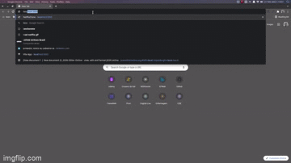

<div align="center" id="top"> 
  

  &#xa0;

  <a href="https://netflixclone.netlify.app">Demo</a>
</div>

<h1 align="center">Netflixclone</h1>

<p align="center">
  

  

  

  

  

  

  
</p>

<!-- Status -->

<!-- <h4 align="center"> 
	🚧  Netflixclone 🚀 Under construction...  🚧
</h4> 

<hr> -->

<p align="center">
  <a href="#dart-about">About</a> &#xa0; | &#xa0; 
  <a href="#sparkles-features">Features</a> &#xa0; | &#xa0;
  <a href="#rocket-technologies">Technologies</a> &#xa0; | &#xa0;
  <a href="#white_check_mark-requirements">Requirements</a> &#xa0; | &#xa0;
  <a href="#checkered_flag-starting">Starting</a> &#xa0; | &#xa0;
  <a href="#memo-license">License</a> &#xa0; | &#xa0;
  <a href="https://github.com/kevinfigueira" target="_blank">Author</a>
</p>

<br>

## :dart: About ##

Project developed in the study of React, with the objective of putting into practice all the knowledge acquired from the course together with Professor Bonieky Lacerda from the B7Web team.

The Netflix clone was made for educational purposes and the data taken from the <a href="https://www.themoviedb.org/">Themoviedb</a> website

## :sparkles: Features ##

:heavy_check_mark: sliding screen;\
:heavy_check_mark: random movies on the main page;\
:heavy_check_mark: movie information;\
:heavy_check_mark: responsive;

## :rocket: Technologies ##

The following tools were used in this project:

- [React](https://pt-br.reactjs.org/)
- [Vitejs](https://vitejs.dev/)

## :white_check_mark: Requirements ##

Before starting :checkered_flag:, you need to have [Git](https://git-scm.com) and [Node](https://nodejs.org/en/) installed, and also an account in <a href="https://www.themoviedb.org/">TMDB</a> to get your API key.

## :checkered_flag: Starting ##

```bash
# Clone this project
$ git clone https://github.com/kevinfigueira/netflixclone

# Access
$ cd netflixclone

# Install dependencies
$ npm install

# Run the project
$ npm run dev

# The server will initialize in the <http://localhost:3000>
```

## :memo: License ##

This project is under license from MIT. For more details, see the [LICENSE](LICENSE.md) file.


Made with :heart: by <a href="https://github.com/kevinfigueira" target="_blank">Kevin Figueira</a>

&#xa0;

<a href="#top">Back to top</a>
